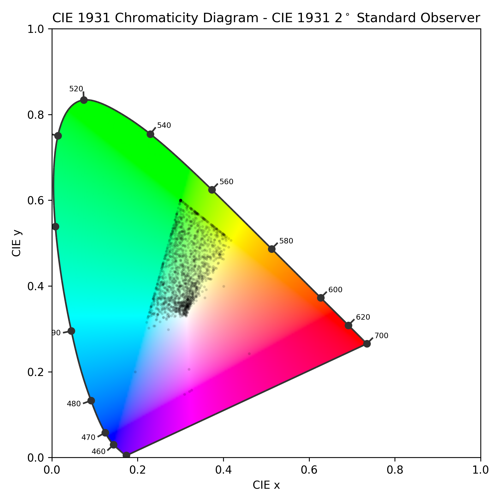

# colorname-analysis
analyzing names of colors using data from [colornames.org](https://colornames.org/)  

## details
- generates plots to show where certain colors (or other color-defining words) are found on the [CIE 1931 chromaticity diagram](plots/CIE1931_Chromaticity_Diagram.png)  
- points are limited to a small(ish) triangle due to the color data only covering rgb colors which only cover a small fraction of human vision
- due the nature of the diagram brightness is ignored
- little to no data cleaning: a color named "definitely not white" may show up in the plot for "white"

## color examples
### blue

### cyan

### mint

### green

### orange

### red

### pink

### purple

### white

## examples for other terms

### deep

### light

### dark

### space

### twilight

### alien

